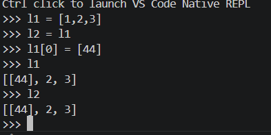

<!-- python does not have any data type, it does not assigned to the variable but its assigned on the value(reference)-->

<!-- pythons garbage collector collects the garbage of number and strings late -->

<!-- if a = 5 and if we do a = a+2 so the new object creaated as the 7 in the memory and a points towards the reference 7  -->

<!-- see the mutable and immutable -->

 
<!--slicing - h1 = h2[:] it makes the copy for the h2-->

<!-- copy vs deepcopy -->

<!-- == checks the value(answers in true/false), m is n checks the objects (true/false) -->

<!-- numbers carries the group of objects -->

<!-- (x+y)*z - code more readible/production level -->

<!-- list vs tuple. -->

<!-- repr('chai')
str('chai')
print('chai') -->

<!-- 1 == 2 < 3 means that 1 == 2 and 2 < 3  -->

<!-- floor gives the value which is smaller than comparitively in integer / and trunc gives  the integer value neare to the zero -->

<!-- int('64' , 8) gives  the converted value into the hexadecimal adn int('55' , 2) gives the value in binary-->

<!-- import statements:- random -(choice,shuffle)

<!-- we can define sets also like setone = {1,2,3,4} and do set operations like |(unioun) and &(intersection)  , -(difference) , ^(symmetric difference) -->

<!-- boolean type , true acts as 1 and false acts 0)

<!-- do the revision of the slicing in string

<!-- .lower /.upper , use of .strip- reduces the whitespaces(useful in web dev) , .replace("lemon" , "ginger") -->

<!-- conversion of string into list:- 
chai ="Lemon , Ginger , Masala , Mint"
print(chai.split())
['Lemon,', 'Ginger,' ,'Masala','Mint,']
print(chai.split(","))

.count and .find . 

Raw string - r.

// LIST:- its array 
do the operations of slicing and dicing 

tea_varities_copy = tea_varirties.copy() - diffrent reference created for the tea_varities_copy

squared_nums = x**2 for x in range(10)] // here only the varibale x declared in the range 0 to 10.

DICTIONARY:-

syntax of the dictionary:- 
 
 to access the individual key of the dictionary:-chai_types["masala]

 syntax:- chai_types = ["masala":"spicy" , "ginger": "zesty" , "green":"mild")

TO change the item in dictionary:- 
chai_types["Green"] = "Fresh"

